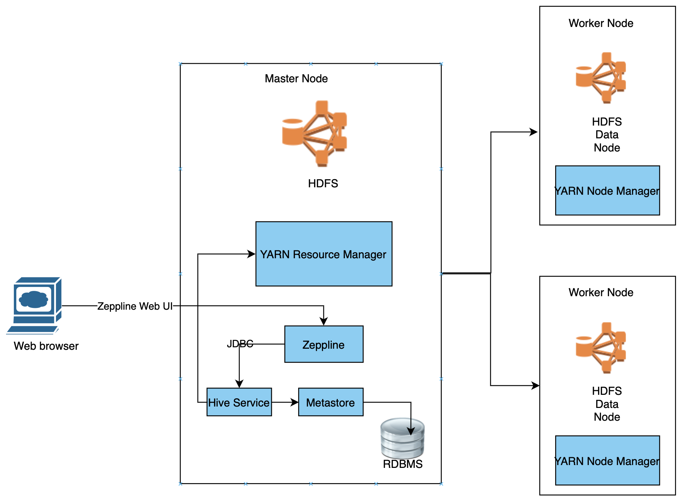

# Hadoop Project
Table of contents
* [Introduction](#Introduction)
* [Hadoop Cluster](#Introduction)
* [Hive Project](#Introduction)
* [Improvements](#Introduction)

# Introdunction 
This project was designed to store and query Big Data using Apache Hadoop and other relevant tools such as HDFS, YARN, MapReduce, Hive, and Zeppelin. A hadoop cluster is provisioned by GCP through DataProc and it includes a master node with 2 worker each consisting of 100 GB of storage. A large public table is imported from Google Storage to a local bucket. Within the cluster, Hive was used to perform the queries as well as other tools to further optimize including OpenCSVSerde, Partitios anand Parquet files. 

# Hadoop Cluster 
### Cluster Hardware Specs.
- Master Node: 2 CPU cores, 12 GB RAM, 100 GB of Storage
- Worker Node (x2): 2 CPU cores, 12 GB RAM, 100 GB of Storage

### Cluster Architeture
